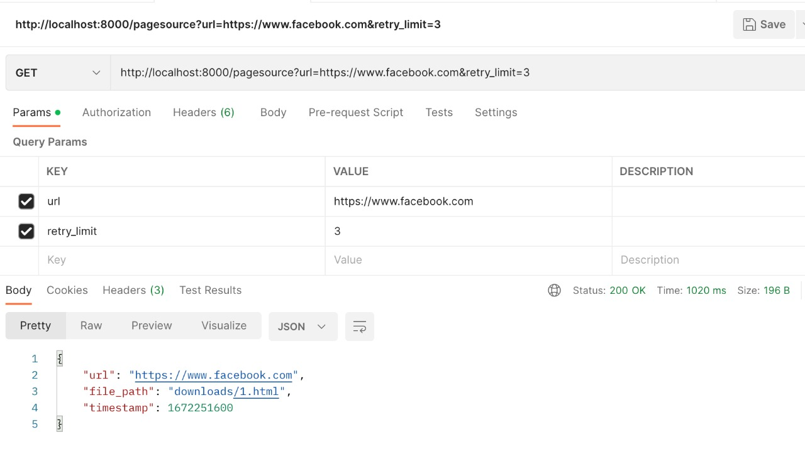
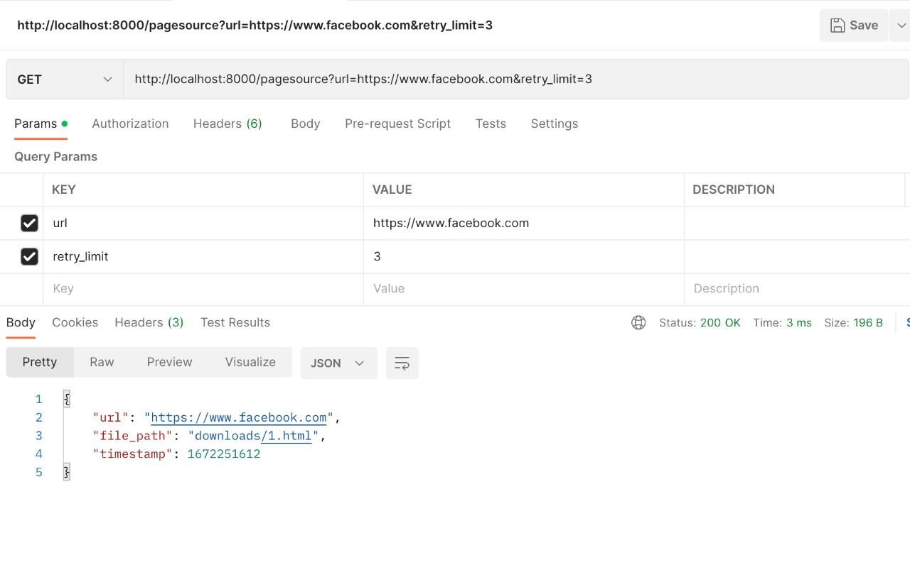

# sendx-assignment

## How to Run
1. install go
2. cd to main.go
3. go run main.go
4. Now open browser or postman and call localhost:portnumber/route?url=url&rate_limit

For example "http://localhost:8000/pagesource?url=https://www.facebook.com&retry_limit=3".
You can notice that for the first time it took some time maybe hundred of ms or even few seconds.
But for the second and third time it just took order of few ms as it was fetching from the cache. 

You can see for yourself
For the first time.

And next time.
